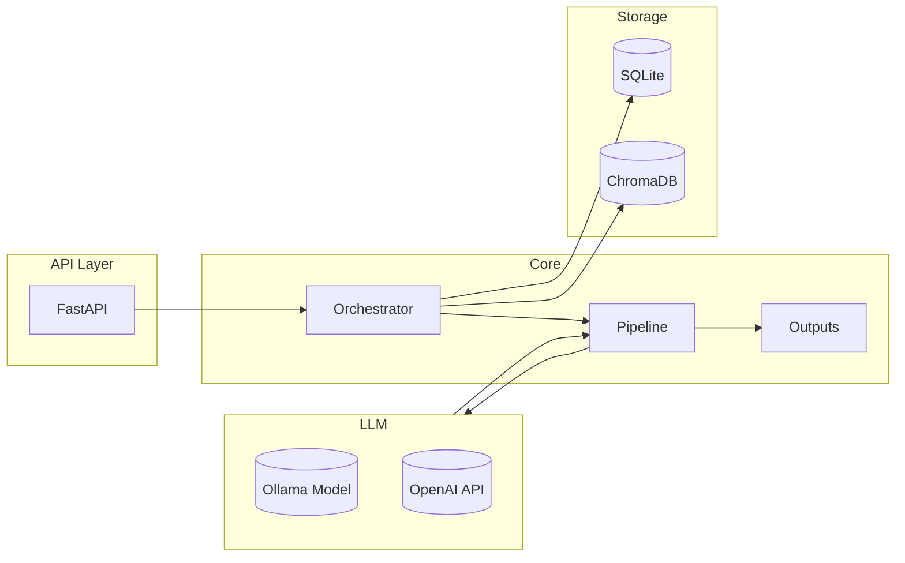
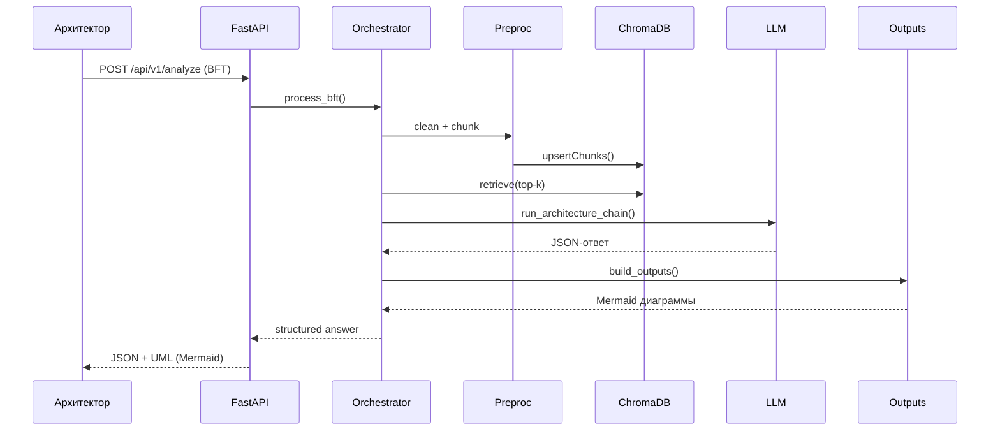

# BFT Semantic Analyzer (MVP)

Платформа для семантического анализа бизнес-функциональных требований (БФТ) с использованием RAG-подхода и локальных/облачных LLM. Система автоматически формирует:

- Solution Architecture-анализ БФТ
- Список задействованных/новых систем
- UML-диаграммы взаимодействий (Mermaid)
- Перечень существующих/новых интеграционных топиков

---

## ✨ Основные возможности

- **RAG по корпоративному каталогу**: ChromaDB + SQLite как реестр систем.
- **LLM-оркестрация**: поддержка Ollama (локально) и OpenAI API.
- **Автоматический вывод**: структурированный JSON + Mermaid-диаграммы (sequence, flowchart).
- **API-ориентированность**: FastAPI с REST endpoint.
- **Расширяемость**: модульная архитектура, подготовлена к интеграции UI.

---

## 🧱 Архитектура (High Level)



## 🔁 Поток обработки запроса


### 🔎 Retrieval (BM25 + векторный)

- Используется `HybridRetrievalManager`: сочетание `BM25Retriever` (rank-bm25) и `Chroma` на sentence-transformers `all-MiniLM-L6-v2`.
- Регистр систем автоматически индексируется и попадает в RAG-контекст.
- Конфигурация:
  - `embedding_model_name` — модель эмбеддингов
  - `bm25_index_path` — JSON с коллекцией документов для BM25
  - `retrieval_top_k` — число документов в контексте


Теперь можно пополнять корпоративный RAG двумя способами:

1. **Через UI**

   - Панель «Загрузить документ в RAG».
   - Заполните `Doc ID`, `Source`, текст и (по желанию) `Metadata JSON`.
   - Нажмите «Сохранить в RAG» — документ разобьётся на чанки, попадёт в гибридный индекс (BM25 + векторный Chroma).

2. **Через API**

   ```bash
   curl -X POST http://localhost:8000/api/v1/rag/documents \
     -H "Content-Type: application/json" \
     -d '{
       "doc_id": "customer-profile-pl",
       "source": "wiki",
       "text": "Документ про профили клиентов...",
       "metadata": {"owner": "team-platform", "tags": ["customer", "profile"]}
     }'


### 🖥️ Интерфейс

**Страница анализа БФТ** теперь разбивает результат на вкладки:
- Архи­тек­тур­ный анализ (текстовые блоки и таблицы)
- Задействованные системы (таблица)
- Интеграционные топики (таблица)
- UML-диаграммы (Mermaid)
- Сырой JSON

Каждую вкладку можно выгрузить в PDF (кнопка «Скачать PDF»). Для экспорта используется `html2canvas` + `jsPDF` (установлены через `npm install jspdf html2canvas`).

**Страница «Управление RAG»** — загрузка знаний и история.

### 🧾 История анализов

- Каждый запрос БФТ сохраняется в SQLite (`bft_analysis_history`).
- REST‑эндпоинты:
  - `GET /api/v1/history?limit=20` — список последних записей.
  - `GET /api/v1/history/latest` — последний анализ (для загрузки по умолчанию).
  - `GET /api/v1/history/{id}` — детальный просмотр.
- UI: на странице «Анализ БФТ» справа отображается история. Клик по записи — подгружает результат и заполняет форму.